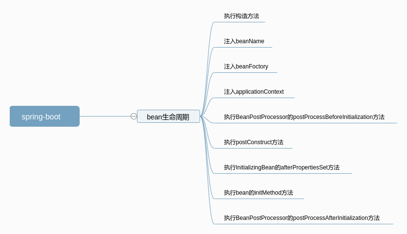

# spring-boot

## bean初始化步骤

- 执行构造方法
- 注入beanName(BeanNameAware)
- 注入beanFactory(BeanFactoryAware)
- 注入ApplicationContext(ApplicationContextAware)
- 执行BeanPostProcessor的postProcessBeforeInitialization方法
- 执行postConstruct方法(@PostConstruct)
- 执行InitializingBean的afterPropertiesSet方法
- 执行initMethod方法
- 执行BeanPostProcessor的postProcessAfterInitialization方法

## 脑图
