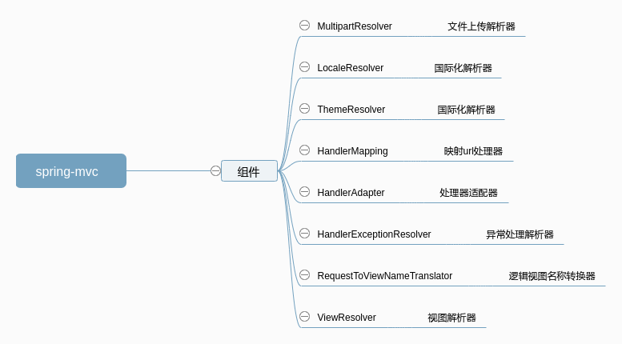

# spring-mvc

## 解析器 (8)

- MutltipartResolver: 文件解析器，用于支持服务器的文件上传
- LocaleResolver: 国际化解析器
- ThemeResolver: 主题解析器
- HandlerMapping: 映射Url处理器
- HandlerAdapter: 处理器适配器
- HandlerExceptionResolver: 处理异常解析器
- RequestToViewNameTranslator: 视图逻辑名称处理器
- ViewResolver: 视图解析器

## 脑图
