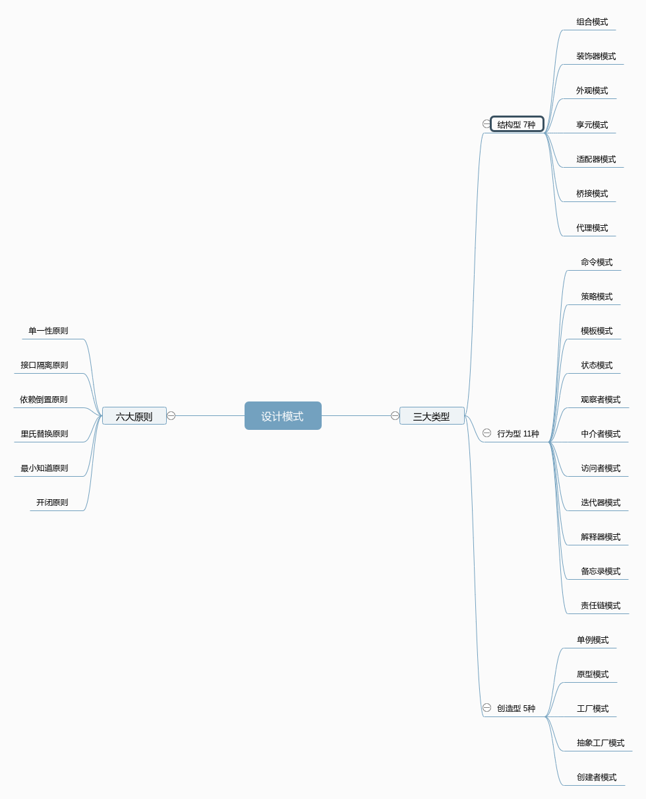

# 设计模式

## 六大设计原则

- 单一性原则
- 接口隔离原则
- 依赖倒置原则
- 里氏替换原则
- 最少知道原则
- 开闭原则

## 三个设计类型

### 结构型 3种

- 组合模式
- 装饰器模式
- 外观模式
- 享元模式
- 适配器模式
- 桥接模式
- 代理模式

### 行为型 11种

- 命令模式
- 策略模式
- 模板模式
- 状态模式
- 观察者模式
- 中介者模式
- 访问者模式
- 迭代器模式
- 解释器模式
- 备忘录模式
- 责任链模式

### 创建型 5种

- 单例模式
- 原型模式
- 工厂模式
- 抽象工厂模式
- 创造者模式

## 脑图

