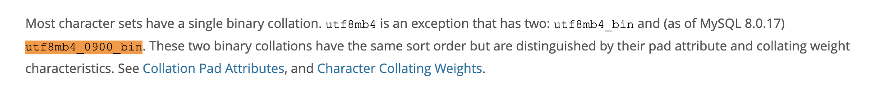

# mysql 字符串尾部空格问题

## 问题描述

当 mysql 字符串尾部出现空格时，如果未查询操作，则尾部空格会被忽略，如:

```sql
select 'a ' = 'a'
-- result: 1
```

如果为更新或新增语句，则尾部空格不会被忽略，如:

```sql
insert into table_a(value_data) values('a ') 
```

结果为:

|id|value_data|
|----|----|
|1|'a '|

以上操作在 mysql 中是闭环的，但当把数据取出用代码去处理时会出现问题，代码默认不会忽略尾部的空格

## 解决方案

### 方案1: 设置字符集 (此方法只对新建的表有效)，要求 mysql 版本为 `8.0.17` 以上



```sql
ALTER DATABASE `tast_db` CHARACTER SET utf8mb4 COLLATE utf8mb4_0900_bin; 
-- or ALTER DATABASE `tast_db` CHARACTER SET utf8mb4 COLLATE utf8mb4_bin; 
```

副作用: mysql 将区分大小写

### 方案2: 使用 `binary`

```sql
select 'a ' = binary'a'
```

副作用: mysql 将区分大小写
