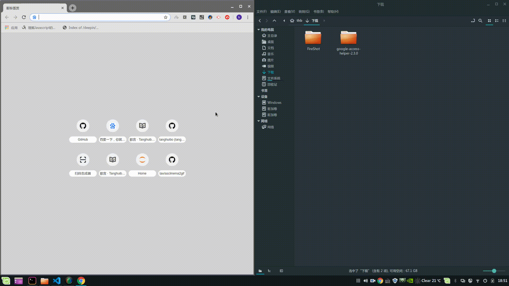

# chrome插件

## 国内连接chrome商店

由于国内不能上google，也无法使用chrome市场，我们可以在chrome安装`google访问助手`插件

## 安装goole访问助手

1. 下载地址 [插件下载助手](https://github.com/haotian-wang/google-access-helper)

2. 打开chrome浏览器， 点开更多工具 -> 扩展程序，将解压后的google访问助手拖到浏览器中

3. 安装google访问助手后便可使用chrome浏览器访问google了
