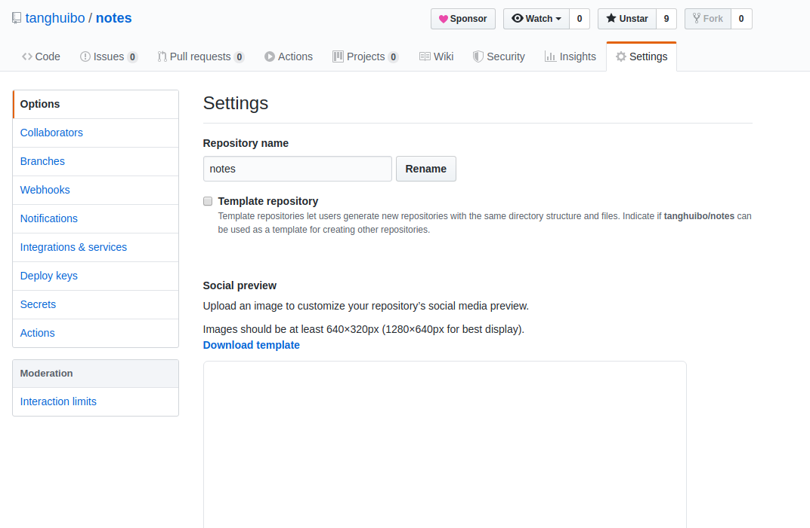
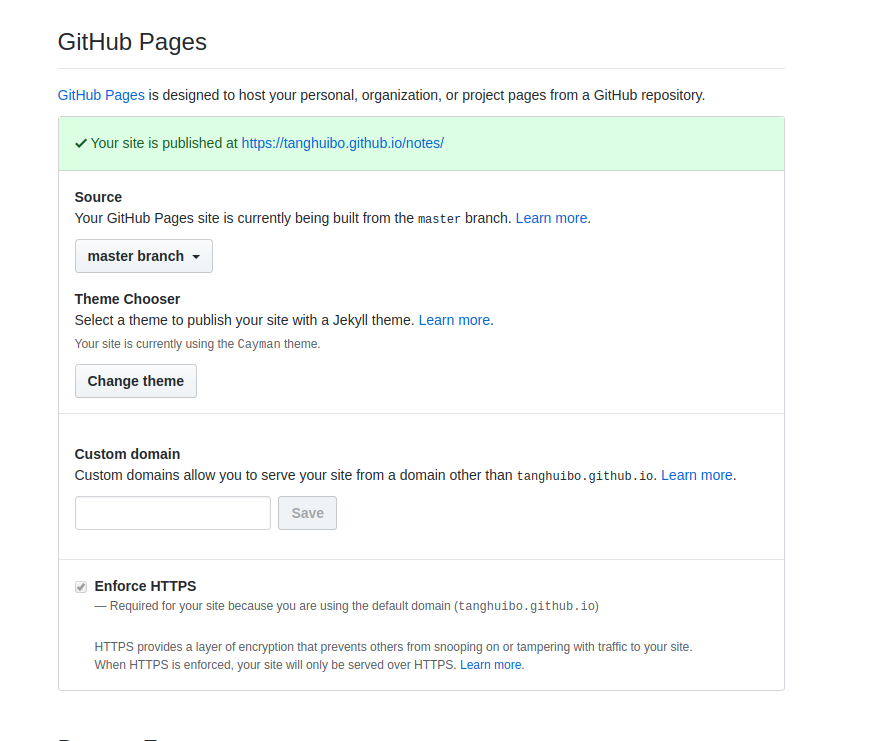

# Github pages使用教程

## github pages简介

github pages可以通过在github托管代码生成静态站点，支持`html`和`md`格式，通过github pages生成站点后，便可通过`用户名.github.io/项目名`访问站点

## 配置

### 进入项目setting配置



### 滑动到靠下位置，找到`github pages`



### 选择站点代码托管位置

支持某个分支的`根目录`或`docs`文件夹下

当代码为前端代码(html + css + js)时，配置到此即完成。

根站点默认使用`index.html`

### 当代码为md格式时，可以为其配置样式

样式配置在`_config.yml`中。

举个例子:

```yml
theme: jekyll-theme-cayman
```

样式选择见: [https://github.com/tanghuibo/notes/settings/pages/themes](https://github.com/tanghuibo/notes/settings/pages/themes)

根站点默认使用`README.md`

