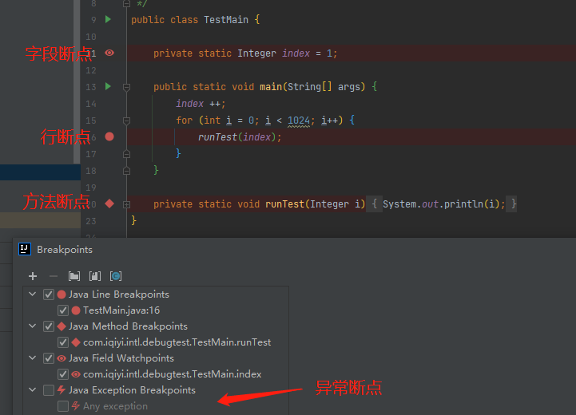
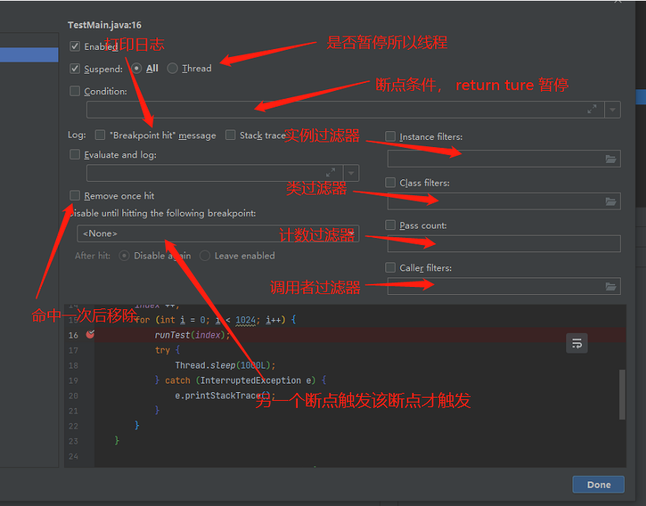
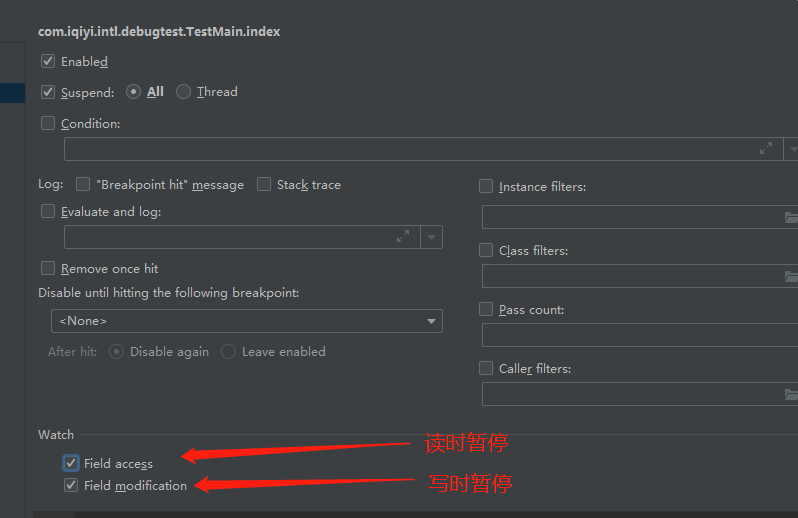
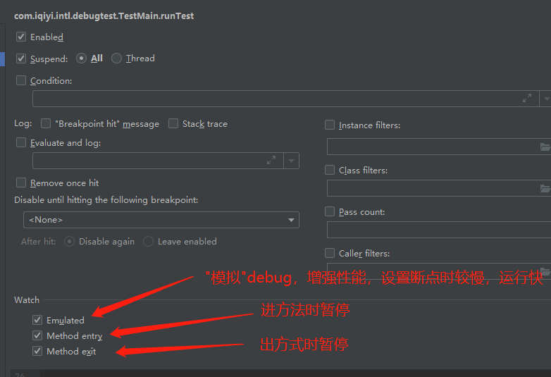
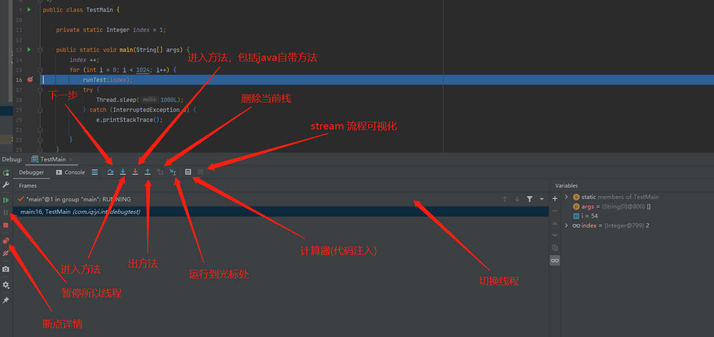
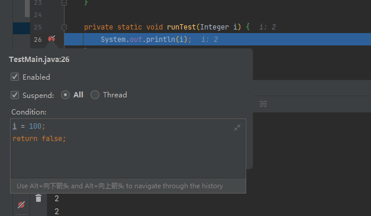
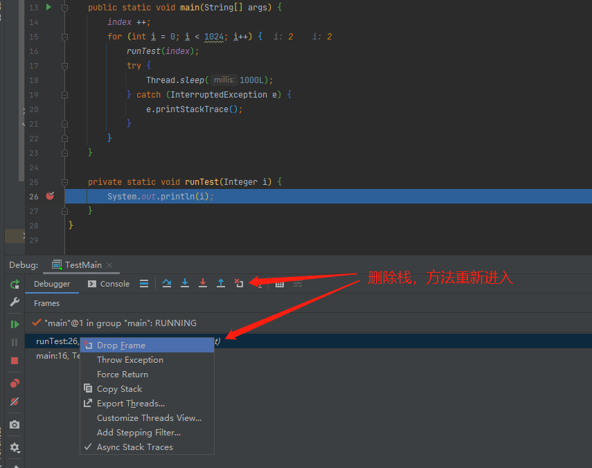
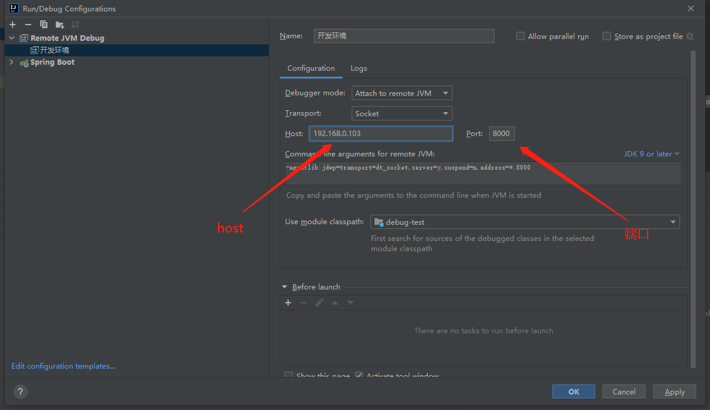

# java debug

## 命令行 debug

### 编写 TestMain.java

```java
public class TestMain {
    public static void main(String[] args) throws Exception {
        for(int i = 0; i < 600; i++) {
            System.out.println("run mian; i=" + i);
            Thread.sleep(1000);
        }
    }
}
```

### 编译 class

```bash
# -g 编译时开启 debug 信息
javac -g TestMain.java
```

### 运行 jdb 工具

```bash
jdb

# 停在什么位置
> stop at TestMain:5

# 开始跑
> run TestMain
```

### 设置断点

- stop at TestMain:5 按位置停止
- stop in TestMain.test 按方法停止
    - stop in TestMain.\<init\> 初始化方法
    - stop in TestMain.\<clinit\> 静态代码块
- watch TestMain.data 监听字段
- catch NullPointerException 出现异常时停止

### 清除断点

- clear TestMain:5
- clear TestMain.test
- unwatch TestMain.data
- ignore NullPointerException


### 常用命令

|命令|作用|
|---|---|
|locals|查看本地变量|
|print i|打印变量(可以跟表达式)|
|list|查看当前断点位置|
|threads|查看线程|
|thread 13|设置当前线程|
|set i = 4|设置变量|
|dump obj|查看对象信息|
|suspend|暂停线程|
|resume|恢复线程|
|redefine TestMain TestMainAfter.class|替换代码(退出debug后不会恢复)|
|up down|切换栈针|
|step|下一步|
|step up|一直执行, 直到当前方法返回到其调用方|
|stepi|执行当前指令|
|cont|从断点出继续|

## idea debug

### 打断点

断点分类:

- 行断点
- 字段断点
- 方法断点
- 异常断点



### 设置断点

- 行断点设置



- 字段断点设置



- 方法断点设置



- 异常断点设置


### 断点操作



### 条件断点改代码

条件断点只要 `return false` 就不会被暂停，`return` 前可以执行代码片段



### 删除栈实现回放

debug 太快了，漏看了关键步骤，可通过该方法退回到方法执行前



## 开启远程 debug

### java -jar 启动

```bash
# java 5 及之前
java -Xdebug -Xrunjdwp:transport=dt_socket,server=y,suspend=n,address=8000 -jar test.jar

# java 5 ~ 8
java -agentlib:jdwp=transport=dt_socket,server=y,suspend=n,address=8000 -jar test.jar

# java 9 之后
java -agentlib:jdwp=transport=dt_socket,server=y,suspend=n,address=*:8000 -jar test.jar
```

### docker 容器

Dockerfile

```
ENTRYPOINT ["java", "-server", "-agentlib:jdwp=transport=dt_socket,server=y,suspend=n,address=8000", "-jar","test.jar"]
```

### jdb 工具远程 debug

```bash
jdb -connect com.sun.jdi.SocketAttach:hostname=localhost,port=8000
```

### idea 设置远程 debug



## idea 远程 debug 插件

[remote-debug](https://github.com/tanghuibo/remote-debug)


## 参考资料
[idea debug教程](https://blog.csdn.net/tanga842428/article/details/78905240)

[idea 官方debug说明](https://www.jetbrains.com/help/idea/using-breakpoints.html#breakpoint-statuses)

[深入Java调试体系之JDWP协议及实现](https://my.oschina.net/itblog/blog/1421889)

[Intellij调试器缓慢：方法断点可能会大大减慢调试速度](https://www.itranslater.com/qa/details/2582200720413950976)

[jdpa](https://www.cnblogs.com/jhxxb/p/11564843.html)