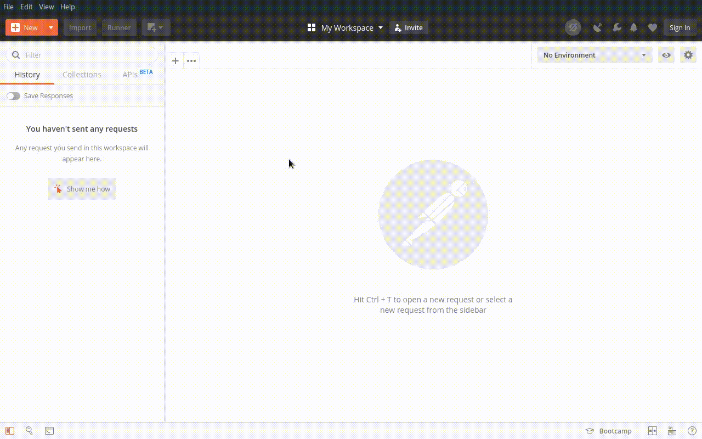
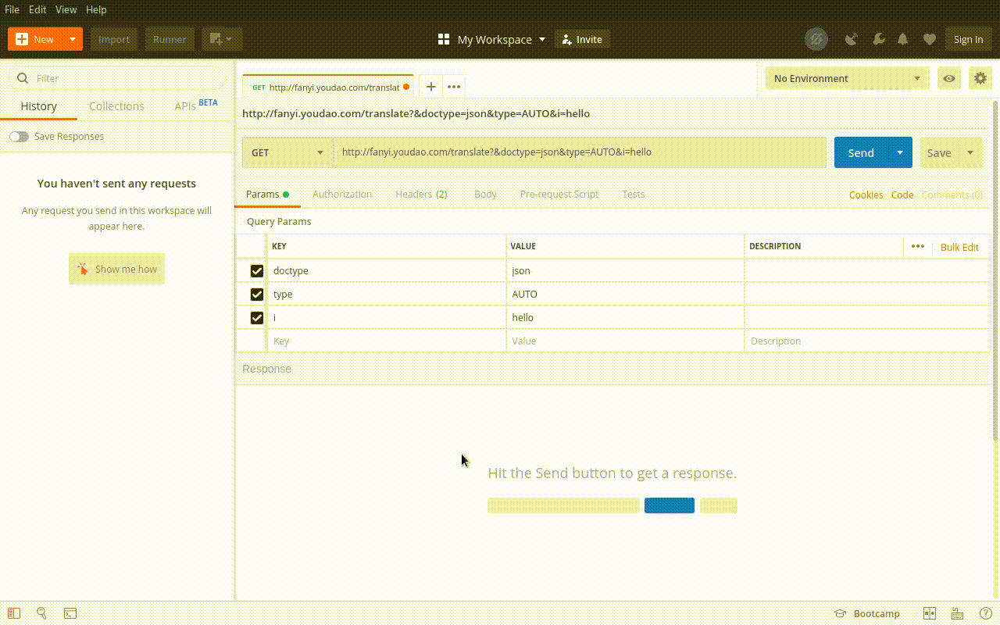

# postman 转换 CURL

## CURL

cURL 是一个利用 URL 语法在命令行下工作的文件传输工具，1997 年首次发行。它支持文件上传和下载，所以是综合传输工具，但按传统，习惯称 cURL 为下载工具。cURL 还包含了用于程序开发的 libcurl。

cURL 支持的通信协议有 FTP、FTPS、HTTP、HTTPS、TFTP、SFTP、Gopher、SCP、Telnet、DICT、FILE、LDAP、LDAPS、IMAP、POP3、SMTP 和 RTSP。

curl 还支持 SSL 认证、HTTP POST、HTTP PUT、FTP 上传, HTTP form based upload、proxies、HTTP/2、cookies、用户名+密码认证(Basic, Plain, Digest, CRAM-MD5, NTLM, Negotiate and Kerberos)、file transfer resume、proxy tunneling。

### 事例

```bash
curl 'http://fanyi.youdao.com/translate?&doctype=json&type=AUTO&i=hello' -H 'Connection: keep-alive' -H 'Accept-Language: zh-CN,zh;q=0.9' --compressed
```

## postman

### 安装 postman

全平台下载地址: [postman 下载地址](https://www.getpostman.com/downloads/)

### 导入 CURL

`import` -> `paste raw text` -> 粘贴 curl 代码 -> `import`



### 获取代码

`code` -> 选择语言


